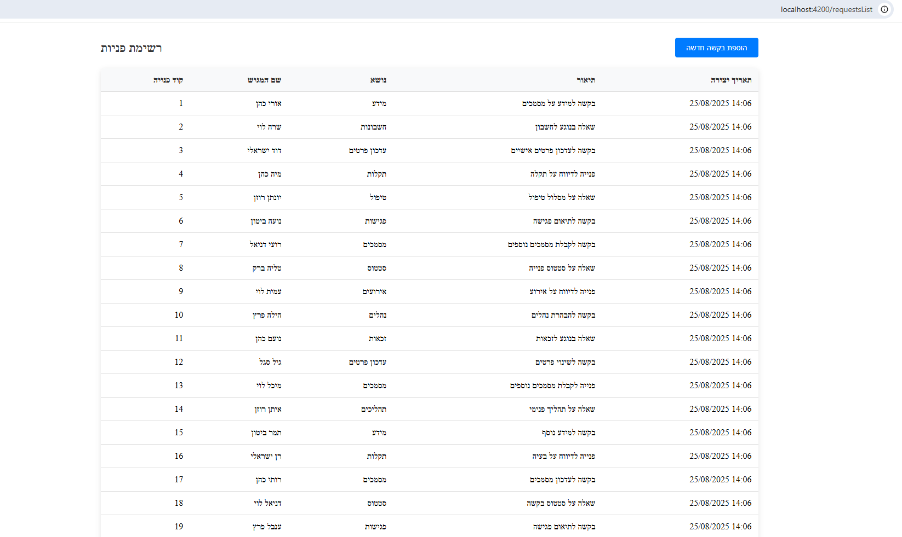
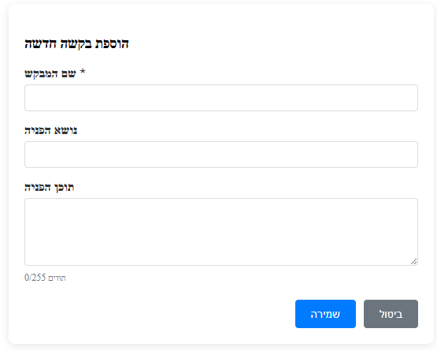
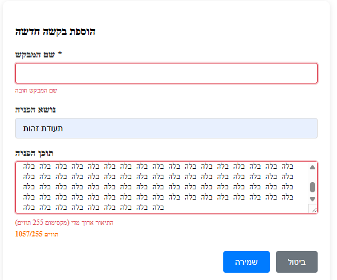
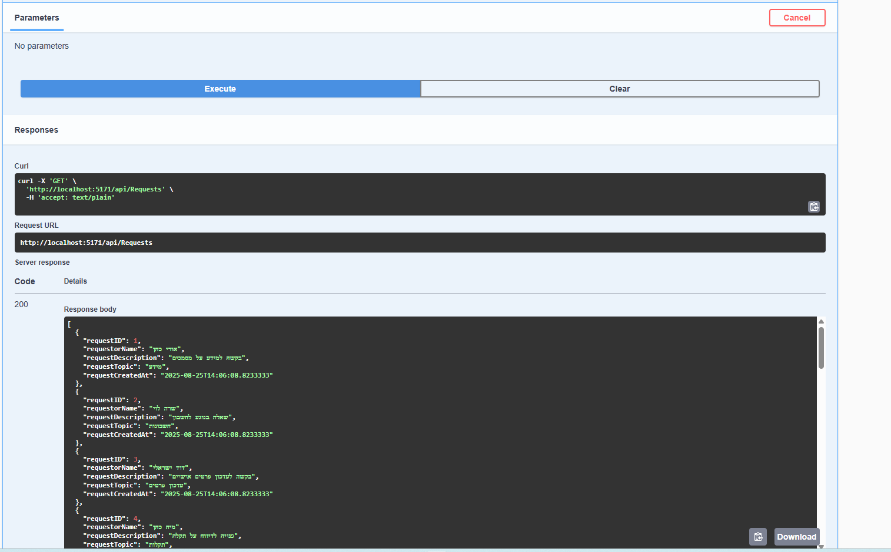

# מערכת פניות ציבור

מערכת לניהול פניות ציבור עם אפשרות צפיה והוספת פניות חדשות.

## 🏗️ ארכיטקטורה

המערכת בנויה בארכיטקטורה של 3 שכבות:

### Backend (.NET Core 8)
- **API Layer** - Web API controllers
- **Business Logic Layer** - שירותים ולוגיקה עסקית
- **Data Access Layer** - Entity Framework + Repository Pattern

### Frontend (Angular 18)
- **Components** - קומפוננטות Angular
- **Services** - שירותים לתקשורת עם API
- **Models** - מודלים לנתונים

## 📋 דרישות מערכת

### Backend
- .NET Core 8.0
- SQL Server / SQL Server Express
- Entity Framework Core
- AutoMapper

### Frontend
- Node.js 18+
- Angular CLI 18
- TypeScript

## 🚀 הרצת המערכת

### 1. הגדרת Backend

```bash
# ניווט לתיקיית API
cd Requests.api

# שחזור packages
dotnet restore

# הרצת השרת (מסד הנתונים כבר קיים)
dotnet run
```

השרת יעלה על: `https://localhost:5171`

### 2. הגדרת Frontend

```bash
# ניווט לתיקיית Angular
cd Requests.client/RequestsApp

# התקנת dependencies
npm install

# הרצת האפליקציה
ng serve
```

האפליקציה תעלה על: `http://localhost:4200`

## 📸 תמונות מסך

### רשימת פניות


### טופס הוספת פנייה


### הודעות ולידציה


### תגובת API


### מסד נתונים 


## 📊 מבנה מסד הנתונים

### טבלת Requests
| שדה | סוג | תיאור |
|-----|-----|--------|
| RequestID | int | מפתח ראשי (Identity) |
| RequestorName | nvarchar(100) | שם הפונה (חובה) |
| RequestTopic | nvarchar(200) | נושא הפנייה |
| RequestDescription | nvarchar(255) | תוכן הפנייה |
| RequestCreatedAt | datetime2 | תאריך יצירה (אוטומטי) |

## 🔌 API Endpoints

### GET /api/requests/list
מחזיר רשימת כל הפניות

**Response:**
```json
[
  {
    "requestID": 1,
    "requestorName": "שם הפונה",
    "requestTopic": "נושא הפנייה",
    "requestDescription": "תוכן הפנייה",
    "requestCreatedAt": "2024-01-01T10:00:00"
  }
]
```

### POST /api/requests/create
יוצר פנייה חדשה

**Request Body:**
```json
{
  "requestorName": "שם הפונה",
  "requestTopic": "נושא הפנייה",
  "requestDescription": "תוכן הפנייה"
}
```

**Response:**
```json
{
  "success": true,
  "message": "בקשה נוצרה בהצלחה",
  "requestId": 1
}
```

## ✅ ולידציות

### צד שרת (Backend)
- **Data Annotations** - ולידציה מובנית ב-DTOs
- שם הפונה - חובה (מקסימום 100 תווים)
- נושא הפנייה - 5-200 תווים (אופציונלי)
- תוכן הפנייה - מקסימום 255 תווים
- **ModelState Validation** - בדיקה אוטומטית

### צד לקוח (Frontend)
- ולידציה בזמן אמת
- הודעות שגיאה ברורות
- מונה תווים לשדה התיאור
- עיצוב ויזואלי לשגיאות

## 🎨 תכונות UI/UX

- **כותרת מקצועית** - עם גרדיאנט ואייקון רלוונטי
- **פביקון מותאם אישית** - 📝 במקום Angular כתום
- עיצוב רספונסיבי
- הודעות משוב למשתמש
- טבלה מסודרת לתצוגת פניות
- טופס אינטואיטיבי להוספת פניות
- ולידציה ויזואלית בזמן אמת
- **מונה תווים** לשדה התיאור
- **הודעות שגיאה מעוצבות** - עם כפתור "נסה שוב"
- **ספינר טעינה** - אינדיקציה ויזואלית לטעינת נתונים
- **דף בית מעוצב** - עם כרטיסי פעולה ומידע חשוב

## 🛠️ טכנולוגיות בשימוש

### Backend
- **ASP.NET Core 8** - Web API Framework
- **Entity Framework Core** - ORM
- **SQL Server** - מסד נתונים
- **AutoMapper** - Object mapping
- **Data Annotations** - ולידציה מובנית
- **ILogger** - Structured logging
- **Dependency Injection** - IoC Container

### Frontend
- **Angular 18** - Frontend Framework
- **TypeScript** - שפת תכנות
- **RxJS** - Reactive programming
- **Angular Forms** - ניהול טפסים
- **HttpClient** - תקשורת HTTP
- **Standalone Components** - ארכיטקטורה מודרנית
- **Lazy Loading** - טעינת קומפוננטות לפי דרישה

## 📁 מבנה הפרויקט

```
Requests/
├── Requests.api/          # Web API
│   ├── Controllers/       # API Controllers
│   ├── Program.cs        # Entry point
│   └── appsettings.json  # הגדרות
├── Requests.bl/          # Business Logic
│   ├── Services/         # שירותים עסקיים
│   ├── DTOs/            # Data Transfer Objects
│   ├── Interfaces/      # ממשקים
│   └── Mappers/         # AutoMapper profiles
├── Requests.dal/        # Data Access Layer
│   ├── Models/          # Entity models
│   ├── Context/         # DbContext
│   ├── Repositories/    # Repository pattern
│   └── Interfaces/      # ממשקי נתונים
└── Requests.client/     # Angular Frontend
    └── RequestsApp/
        └── src/app/
            ├── components/  # קומפוננטות
            ├── services/    # שירותים
            └── models/      # מודלים
```

## 🔧 הגדרות נוספות

### Connection String
עדכן את ה-connection string ב-`appsettings.json`:

```json
{
  "ConnectionStrings": {
    "DefaultConnection": "Server=.;Database=RequestsDB;Trusted_Connection=true;TrustServerCertificate=true;"
  }
}
```

### CORS
השרת מוגדר לקבל בקשות מ-`http://localhost:4200`

## 📝 הערות למפתחים

- המערכת משתמשת ב-Database First approach (Scaffold-DbContext)
- יש הפרדה ברורה בין השכבות
- כל השכבות מבוססות על Dependency Injection
- **ולידציה מתקדמת** - Data Annotations + ModelState
- **Structured Logging** - עם ILogger למעקב שגיאות
- הקוד כולל טיפול בשגיאות מקיף
- **עיצוב מקצועי** - כותרת ופביקון מותאם אישית
- **Error Handling מתקדם** - הודעות שגיאה במסך עם אפשרות ניסוי חוזר
- **Loading States** - אינדיקציה ויזואלית למצבי טעינה
- **Custom Routes** - ניתובים ספציפיים לכל API endpoint
- המערכת תומכת בהרחבות עתידיות

## 🎯 עמידה בדרישות המבחן

### דרישות חובה:
✅ Web API עם GET ו-POST endpoints  
✅ Entity Framework Database First (Scaffold)  
✅ מסד נתונים SQL Server  
✅ כל השדות הנדרשים (שם פונה, נושא, תוכן, תאריך)  
✅ ולידציה בסיסית (שם חובה, נושא מינימום 5 תווים)  
✅ Angular frontend  
✅ טבלת תצוגה של פניות  
✅ טופס הוספת פנייה  
✅ ולידציות בצד לקוח  
✅ HttpClient לתקשורת עם API  
✅ עיצוב בסיסי  

### תכונות מתקדמות נוספות:
🚀 Data Annotations ו-ModelState Validation  
🚀 Structured Logging עם ILogger  
🚀 Error Handling מתקדם עם הודעות במסך  
🚀 Loading States וספינרים  
🚀 עיצוב מקצועי עם כותרת וגרדיאנט  
🚀 אייקון מותאם אישית  
🚀 Custom API Routes (/list, /create)  
🚀 ולידציה בזמן אמת עם מונה תווים  
